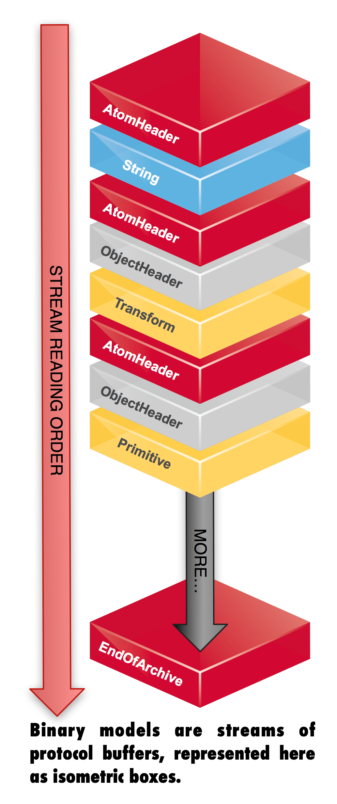

O3DBIN binary model format specification
========================================

(C) 2011, Tonchidot Corporation.

Licensed under the Apache License, Version 2.0 (the "License"); you may not use this file except in compliance with the License.

You may obtain a copy of the License at [http://www.apache.org/licenses/LICENSE-2.0](http://www.apache.org/licenses/LICENSE-2.0).

Unless required by applicable law or agreed to in writing, software distributed under the License is distributed on an "AS IS" BASIS, WITHOUT WARRANTIES OR CONDITIONS OF ANY KIND, either express or implied. See the License for the specific language governing permissions and limitations under the License.

Changelog
---------

    Apr 15 2011    Initial release

About
-----

This document presents the O3DBIN 3D model format, a binary format developed by Tonchidot Corporation and intended to be used with the AndroidO3D 3D engine.

Rationale
---------

3D model import capabilities of previous versions of AndroidO3D were limited to the Collada DAE format which, while the prefered exchange format amongst the CG artists community, suffers from consuming too much resources when it's to be loaded inside an application.

DAE files describe 3D models using XML, which is text based. While one could certainly argue a textual description of geometry has by nature a much bigger size footprint than its binary equivalent, in practice such reasonning doesn't hold as both text and binary resource files are often compressed and and their size end up being very similar.

On the other hand, parsing a text-based format means executing a large amount of text operations such as string comparisons and regular expression matching, which in turn slows down the loading of the actual 3D model a lot. On top of that, the various Collada loaders available on the market (AndroidO3D uses FCollada) are DOM based ---the whole document is first parsed, and only then made available to client code.

Our approach is to serialize the various structures used by the 3D engine to allow their reconstruction at a later time. Whereas some serialization/deserialization code was available as part of the source code of the old now-abandonned O3D web browser plugin, that described a 3D model using a JSON-formatted text file, O3DBIN is one hundred percent binary which supports various compression schemes.

Implements two classes for using with the open-source [Protobuf](http://code.google.com/p/protobuf/) C++ library, LzmaInputStream and LzmaOutputStream, that compress and decompress data using [Igor Pavlov's public domain LZMA SDK](http://www.7-zip.org/sdk.html). Achieved compression ratio is often twice as good as with GZip compression.

